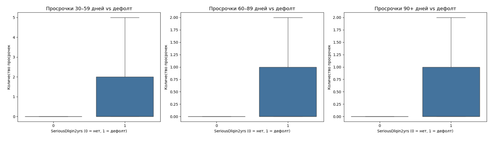
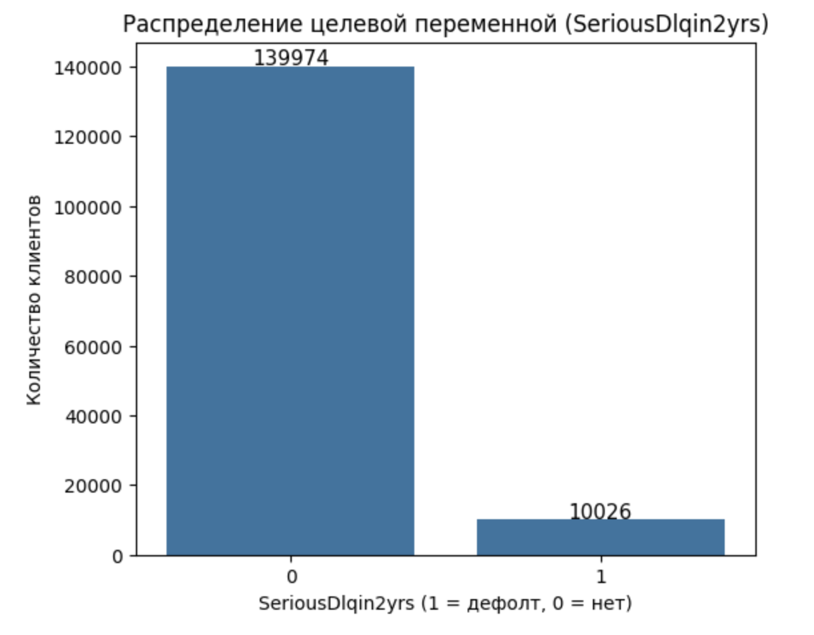
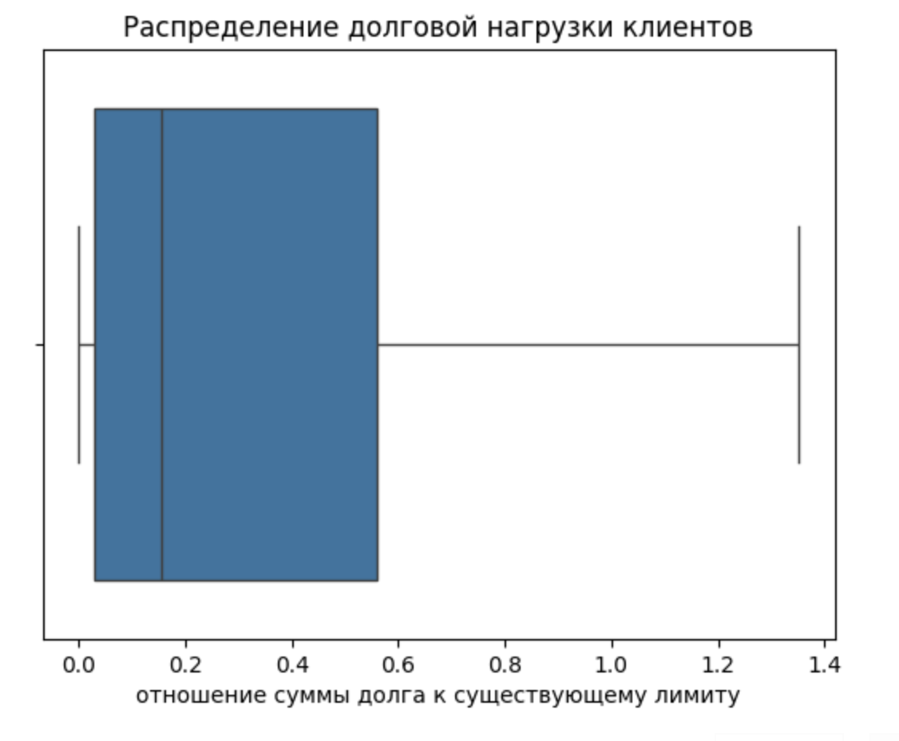
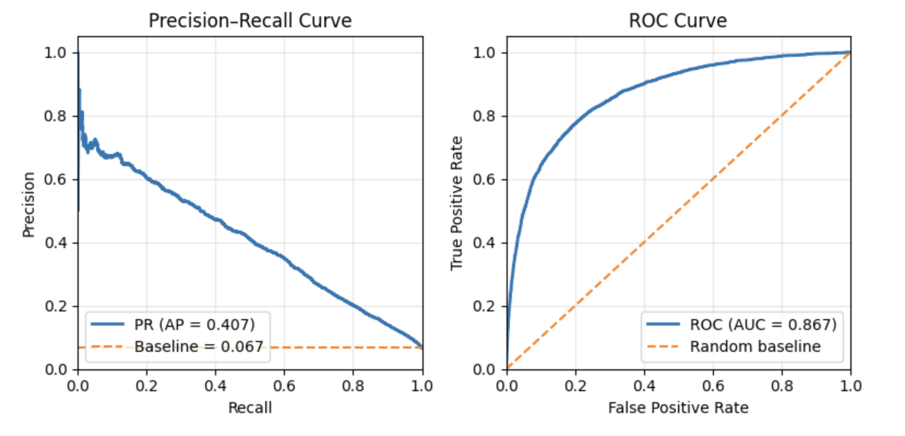
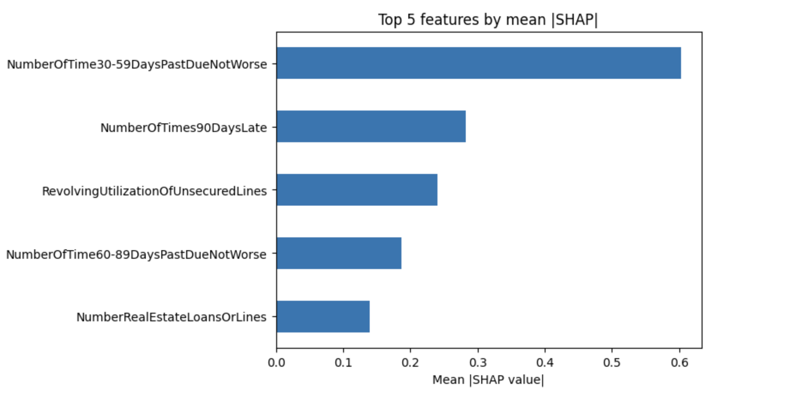
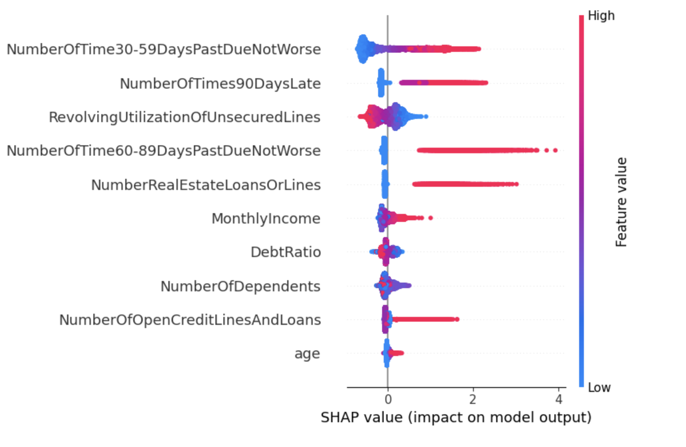

# Отчет

- [Отчет](#отчет)
  - [Описание данных и предварительная обработка](#описание-данных-и-предварительная-обработка)
  - [Тренировка модели](#тренировка-модели)
    - [Результаты и визуализация](#результаты-и-визуализация)
  - [Интерпретация](#интерпретация)
    - [Глобальная важность признаков](#глобальная-важность-признаков)
  - [Этика](#этика)
  - [Общие выводы о валидации и рекомендации модели](#общие-выводы-о-валидации-и-рекомендации-модели)
    - [Качество](#качество)
    - [Ограниченния](#ограниченния)
    - [Рекомендации](#рекомендации)
   

> Весь код с комментариями в [блокноте](https://github.com/ForYourEyesOnlyyy/alpha-test/blob/main/alpha-test.ipynb)

## Описание данных и предварительная обработка

Данные представляют собой кредитную выборку для задачи бинарной классификации — прогнозирования вероятности дефолта клиента в течение двух лет (`SeriousDlqin2yrs`).
Целевая переменная сильно дисбалансна: положительный класс (дефолт) составляет лишь около **6–7%** от общего числа наблюдений.

Для борьбы с дисбалансом были протестированы два подхода:
- SMOTE (Synthetic Minority Oversampling Technique) – искусственное дополнение выборки положительными примерами;
- class_weight='balanced' – балансировка весов классов при обучении.

По результатам валидации на всех трёх моделях (*Logistic Regression*, *XGBoost*, *CatBoost*) метод с балансировкой весов показал себя лучше и был использован в финальных экспериментах.

Большинство числовых признаков имеют существенные правосторонние выбросы в сторону бесконечности, что приводит к смещению среднего значения врпаво. Для смягчения влияния хвостов распределений применялось логарифмирование (*log-transform*).
Были протестированы варианты моделей с логарифмированием и без него - использование лог-трансформации дало заметное улучшение качества.

Из-за наличия выбросов (и, как следствие, смещения среднего) стратегия заполнения пропусков была выбрана как медианная импутация, поскольку медиана устойчивее к экстремальным значениям.

Для нормализации признаков использовался стандартный скейлинг (*StandardScaler*).

Уже на этапе разведочного анализа данных (EDA) была выявлена корреляция между положительным классом целевой переменной и трёмя признаками просрочки платежей (`NumberOfTime30-59DaysPastDueNotWorse`,` NumberOfTime60-89DaysPastDueNotWorse`, `NumberOfTimes90DaysLate`).
Позднее анализ важности признаков с помощью SHAP полностью подтвердил их ключевое влияние на риск дефолта.

Визуализация некоторых признаков (подробнее в [блокноте](https://github.com/ForYourEyesOnlyyy/alpha-test/blob/main/alpha-test.ipynb))

распределение количества просрочек разной длительности (30–59, 60–89 и 90+ дней) для клиентов с дефолтом и без него

  

Распределение целевой переменной (`SeriousDlqin2yrs`) 

  

Долговая нагрузка клиентов (`RevolvingUtilizationOfUnsecuredLines`) 

  

## Тренировка модели

Были протестированы три классификатора: *Logistic Regression*, *XGBoost* и *CatBoost*.
По итогам сравнительной оценки **CatBoost** показал наилучшие результаты по всем ключевым метрикам и был выбран в качестве финальной модели.

Для оценки качества использовались следующие метрики:
- Precision, Recall, F1-score, Accuracy - стандартные метрики классификации;
- PR-AUC - основная метрика при сильном дисбалансе классов;
- ROC-AUC - дополнительная метрика для проверки общей способности модели различать классы.

Целевая переменная крайне несбалансирована - дефолт встречается только у ~6% клиентов.
При таком дисбалансе *Accuracy* теряет смысл, так как даже константное предсказание “все 0” (все без дефолта) дало бы около 93% точности.
Поэтому *Accuracy* использовалась лишь как справочный показатель - чтобы оценить, насколько модель превосходит этот базовый уровень (baseline).

Основной метрикой выбрана **PR-AUC ~ 0.40**.
Она более адекватно отражает качество классификатора в условиях дисбаланса,
так как показывает, как меняются *Precision* и *Recall* при разных порогах классификации.

Для PR-AUC базовым уровнем выступает *prevalence* - доля положительного класса в данных (~0.06),
то есть вероятность «поймать дефолт» случайным образом.
Полученное значение PR-AUC в 6-7 раз выше базового уровня, что говорит о способности модели эффективно различать дефолтных и надёжных клиентов, даже при сильном смещении классов.

Для сравнения рассчитан ROC-AUC ~ 0.86, что также подтверждает высокое качество модели
(базовым уровнем для ROC-AUC служит случайный классификатор - 0.5).

При стандартном пороге 0.5 модель показывала высокую точность, но низкий Recall (~0.19),
что означает - она находила лишь часть дефолтных клиентов.
Для балансировки Precision и Recall был выбран порог, максимизирующий F1-score (0.2).

При этом F1-score вырос с 0.29 → 0.45, Recall - с 0.19 → 0.49,
а точность снизилась незначительно (0.94 → 0.92), что считается хорошим компромиссом.

### Результаты и визуализация

| Метрика   | @0.5 | @Best F1 (~0.2) |
|------------|------|-----------------|
| Precision  | 0.62 | 0.42            |
| Recall     | 0.19 | 0.49            |
| F1         | 0.29 | 0.45            |
| Accuracy   | 0.94 | 0.92            |

PR-AUC = 0.40 | ROC-AUC = 0.86 | Baseline (prevalence) = 0.06

Ниже приведены графики Precision–Recall и ROC–AUC кривых,
а также таблицы с метриками и матрицей ошибок (confusion matrix) для оптимального порога.

  

## Интерпретация
Для интерпретации работы модели был проведён SHAP-анализ (SHapley Additive exPlanations).
Так как *SHAP* и *LIME* дают локальные объяснения, то есть показывают вклад признаков в предсказание для конкретного примера, для получения глобальной картины важности признаков были вычислены значения SHAP для всех наблюдений evaluation-сета, после чего рассчитано среднее абсолютное значение SHAP по каждому признаку.

### Глобальная важность признаков
По результатам анализа наибольший вклад в прогноз дефолта вносили следующие признаки:
- `NumberOfTime30–59DaysPastDueNotWorse`
  - Количество просрочек 30–59 дней за 2 года. Клиенты с частыми краткими просрочками чаще попадают в дефолт
    - увеличивает риск
- `NumberOfTimes90DaysLate`
  - Просрочки 90+ дней - сильнейший индикатор ненадёжности заёмщика
    - увеличивает риск
- `RevolvingUtilizationOfUnsecuredLines`
  - Отношение задолженности к доступному кредитному лимиту. Чем выше использование лимита, тем выше нагрузка и риск
    - увеличивает риск
- `NumberOfTime60-89DaysPastDueNotWorse`
  - Средние просрочки также связаны с дефолтом, но влияние слабее, чем у крайних случаев
    - увеличивает риск
- `NumberRealEstateLoansOrLines`
  - Количество кредитов, обеспеченных недвижимостью. Модератное значение показателя снижает риск, а слишком высокое - может указывать на перегрузку
    - нелинейное влияние
  

  

Выводы из наблюдений:
- Все три признака, связанные с просрочками, ожидаемо оказались наиболее значимыми и подтверждают результаты **EDA**: чем чаще клиент допускает просрочки, тем выше вероятность дефолта.
- Признак `RevolvingUtilizationOfUnsecuredLines` (кредитная нагрузка) также оказывает сильное влияние: высокая загрузка кредитных лимитов ведёт к росту риска.
- Наличие нескольких реальных активов (ипотек) умеренно снижает риск, но слишком большое количество может указывать на финансовую перегрузку.

  

**Summary plot**, где цвет отражает значение признака (от низких - синие точки, до высоких - красные),
а положение вдоль оси X - направление и силу влияния на вероятность дефолта.

Можно видеть, что высокие значения признаков, связанных с просрочками и кредитной нагрузкой,
систематически смещают предсказание модели в сторону дефолта,
что соответствует бизнес-логике и подтверждает корректность работы классификатора.

## Этика
Для проверки объективности работы модели была проведена оценка **fairness** - насколько одинаково модель ведёт себя для разных подгрупп пользователей.
Мы сознательно выбрали признаки, менее влияющие на итоговую классификацию (по результатам *SHAP*), но потенциально связанные с социально чувствительными характеристиками.

Были выделены три группы:
- Возраст: `<30`, `30-40`, `40-60`, `60+`
- Количество иждивенцев: `0`, `>=1`
- Отношение платежей по кредитам к доходу (DebtRatio): `[0,1)`, `[1,+inf)`

Для каждой группы рассчитаны ключевые метрики:
TPR (True Positive Rate), FPR (False Positive Rate), Precision, Accuracy, а также доля выборки, попавшая в класс дефолта (Selection Rate).
Затем сравнили минимальные и максимальные значения метрик внутри каждой группы

**Взраст**
| age_group | count  | prevalence | selection_rate |   TPR   |   FPR   | Precision | Accuracy |   TP  |  FP  |   TN  |  FN  |
|------------|--------|-------------|----------------|---------|---------|------------|-----------|-------|------|-------|------|
| <30        | 2623   | 0.125429    | 0.161266       | 0.5410  | 0.1068  | 0.4208     | 0.8490    | 178   | 245  | 2049  | 151  |
| 30-40      | 7003   | 0.101814    | 0.125375       | 0.5470  | 0.0776  | 0.4442     | 0.8842    | 390   | 488  | 5802  | 323  |
| 40-60      | 20792  | 0.074307    | 0.084792       | 0.4803  | 0.0530  | 0.4209     | 0.9123    | 742   | 1021 | 18226 | 803  |
| 60+        | 14582  | 0.028871    | 0.026402       | 0.3634  | 0.0164  | 0.3974     | 0.9657    | 153   | 232  | 13929 | 268  |

ΔTPR = 0.1836 ΔFPR = 0.0904 ΔAccuracy = 0.1167 ΔSelectionRate = 0.1349

- Модель чаще находит дефолт среди молодых клиентов (<40) и реже среди пожилых (60+)
- TPR и FPR постепенно снижаются с возрастом, что может указывать на умеренный возрастной bias
- Однако разрывы по метрикам умеренные — существенной дискриминации не наблюдается

**Количество иждевенцев**
| debt_income_group | count  | prevalence | selection_rate |   TPR   |   FPR   | Precision | Accuracy |   TP  |  FP  |   TN  |  FN  |
|-------------------|--------|-------------|----------------|---------|---------|------------|-----------|-------|------|-------|------|
| [0,1)             | 34291  | 0.066606    | 0.077134       | 0.4781  | 0.0485  | 0.4129     | 0.9200    | 1092  | 1553 | 30454 | 1192 |
| [1,+inf)          | 10709  | 0.067607    | 0.075077       | 0.5124  | 0.0434  | 0.4614     | 0.9266    | 371   | 433  | 9552  | 353  |

ΔTPR = 0.0343 ΔFPR = 0.0052 ΔAccuracy = 0.0067 ΔSelectionRate = 0.0021

- Различия между клиентами с иждивенцами и без минимальны
- TPR и FPR отличаются незначительно (<3 п.п.), что говорит о справедливом поведении модели в этом разрезе

**Debt Ratio**
| debt_income_group | count  | prevalence | selection_rate |   TPR   |   FPR   | Precision | Accuracy |   TP  |  FP  |   TN  |  FN  |
|-------------------|--------|-------------|----------------|---------|---------|------------|-----------|-------|------|-------|------|
| [0,1)             | 34291  | 0.066606    | 0.077134       | 0.4781  | 0.0485  | 0.4129     | 0.9200    | 1092  | 1553 | 30454 | 1192 |
| [1,+inf)          | 10709  | 0.067607    | 0.075077       | 0.5124  | 0.0434  | 0.4614     | 0.9266    | 371   | 433  | 9552  | 353  |

ΔTPR = 0.0343 ΔFPR = 0.0052 ΔAccuracy = 0.0067 ΔSelectionRate = 0.0021

- Модель ведёт себя стабильно для клиентов с разной долговой нагрузкой
- Различия между группами минимальны (<3-4 п.п.), что говорит об отсутствии статистически значимого bias по DebtRatio

Вывод об объективности модели:
- Модель демонстрирует умеренное снижение чувствительности (TPR) с увеличением возраста, что может указывать на осторожность при классификации пожилых клиентов
- По остальным признакам (наличие иждивенцев, долговая нагрузка) существенных различий не наблюдается - модель ведёт себя справедливо
- В целом, отклонения по FPR/TPR между группами находятся в пределах ±0.03-0.18, что укладывается в допустимые рамки для бизнес-моделей без прямой социальной дискриминации

## Общие выводы о валидации и рекомендации модели

### Качество
Построенная модель кредитного скоринга на основе CatBoost продемонстрировала высокую способность различать дефолтных и надёжных клиентов при критическом дисбалансе классов

Ключевые метрики показали стабильные результаты:
- **PR-AUC ~ 0.40** (**в 6-7 раз выше случайного базиса** ~0.06)
-	**ROC-AUC ~ 0.8**6, что также указывает на хорошее ранжирование клиентов по риску
- При оптимальном пороге (~0.2) достигается баланс Precision/Recall, **F1 ~ 0.45** при общей точности около 0.92

Таким образом, модель достаточно надёжна для приоритезации клиентов по уровню риска, днако не является идеальной системой автоматического одобрения кредитов - часть дефолтов всё ещё остаётся нераспознанной (Recall < 0.5)

### Ограниченния
1. Дисбаланс классов остаётся серьёзным фактором: при низкой доле дефолтов даже небольшое смещение порога влияет на Precision и Recall
2. Качество данных ограничивает точность: отсутствуют признаки, описывающие поведение клиентов во времени (например, динамика платежей, длительность кредитной истории)
3. Некоторые признаки коррелируют между собой, что может влиять на интерпретацию SHAP и на стабильность модели
4. Модель обучалась на исторических данных, не учитывающих экономические изменения (например, макрофинансовые шоки, инфляцию), поэтому для применения в будущем потребуется периодическая переобучаемость

### Рекомендации
- Собрать дополнительные данные:
  - поведенческие признаки (частота платежей, изменение лимита, новые кредиты)
	- макроэкономические индикаторы (ставки, инфляция, региональные риски)
	- категориальные признаки клиента (тип занятости, семейное положение, стаж)
- Улучшить баланс классов
- Периодически переобучать модель, чтобы учитывать изменения в поведении клиентов и экономике
- Проверить прокси-признаки, чтобы убедиться, что модель не косвенно использует чувствительные атрибуты (например, возраст через доход, если добавить доход)

**Пример интерпретации прогноза**
> Как изменится прогноз, если у заёмщика появится иждивенец?
- По SHAP-анализу признак `NumberOfDependents` имеет умеренное отрицательное влияние на вероятность дефолта - то есть само наличие иждивенцев незначительно увеличивает риск, но эффект мал по сравнению с факторами, отражающими финансовое поведение (просрочки и долговая нагрузка). Например, если у клиента без просрочек появляется один иждивенец, его прогнозируемая вероятность дефолта изменится меньше чем на 1-2 процентных пункта, в то время как появление даже одной просрочки 30-59 дней увеличивает риск в несколько раз.

